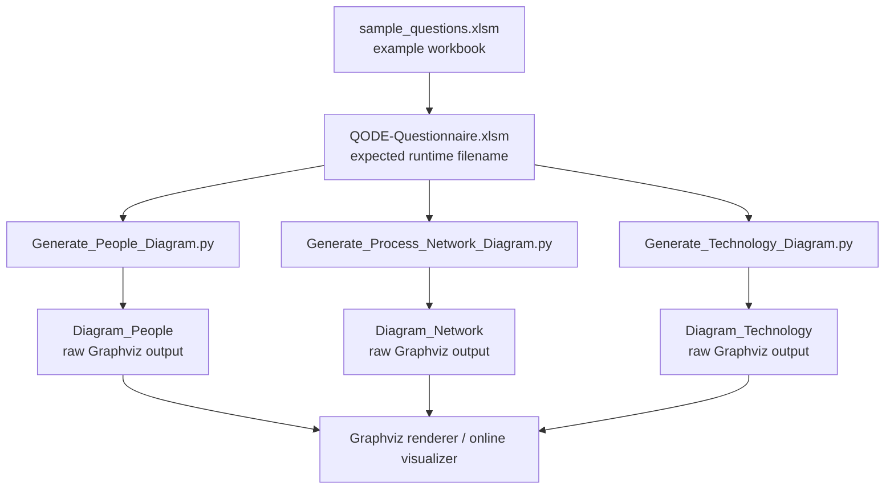
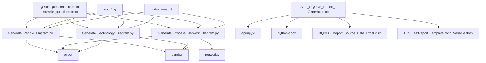
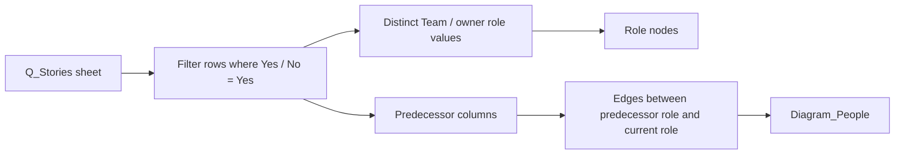
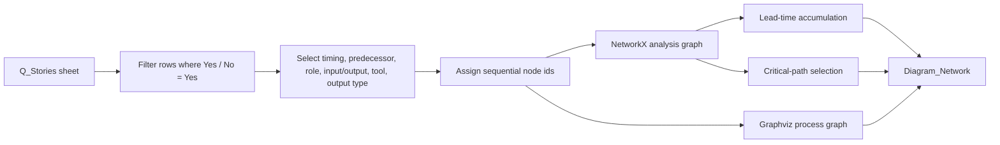
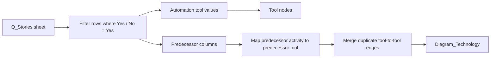

# advanced-QODE Documentation

## Overview
advanced-QODE generates DevSecOps assessment diagrams from an Excel questionnaire workbook. The repository centers on three Python scripts that read the `Q_Stories` worksheet from a workbook expected to be named `QODE-Questionnaire.xlsm`, filter rows where `Yes / No == "Yes"`, and export raw Graphviz `.dot` content for visualization.

## What the repository does
- Builds a **people interaction diagram** from owner roles and task predecessors.
- Builds a **process network diagram** with lead-time and critical-path logic.
- Builds a **technology dependency diagram** from automation tools and task predecessors.
- Contains a separate text-based prototype for **automated report generation** from Excel and Word templates.
- Includes unit tests for the three diagram generators.

## Repository structure
| File | Type | Purpose |
|---|---|---|
| `README.md` | Markdown | Minimal project title and short description. |
| `instructions.txt` | Text | Manual setup and execution steps for the diagram scripts. |
| `Generate_People_Diagram.py` | Python | Generates the role-to-role dependency graph. |
| `Generate_Process_Network_Diagram.py` | Python | Generates the process network and critical-path view. |
| `Generate_Technology_Diagram.py` | Python | Generates the tool-to-tool dependency graph. |
| `test_Generate_People_Diagram.py` | Python test | Unit tests for `People_Diagram`. |
| `test_Generate_Process_Network_Diagram.py` | Python test | Unit tests for `Process_Diagram`. |
| `test_Generate_Technology_Diagram.py` | Python test | Unit tests for `Technology_Diagram`. |
| `Auto_DQODE_Report_ Generation.txt` | Text / prototype script | Notebook-style draft for generating a Word report from Excel data. |
| `sample_questions.xlsm` | Excel macro workbook | Sample questionnaire workbook; contains sheets `Tables_PAQ`, `Q_Stories`, `Tables_Cat`, and `Tables_TechMap`. |
| `.gitignore` | Config | Standard Python ignore rules for caches, virtual environments, build outputs, and editor files. |
| `LICENSE` | License | Repository licensing terms. |

## End-to-end flow

## Source-level dependency graph

## Runtime dependencies
### Clearly used libraries
- `pandas`: reads Excel sheets and filters questionnaire rows.
- `pydot`: builds Graphviz nodes and edges.
- `networkx`: used only in `Generate_Process_Network_Diagram.py` for graph traversal and critical-path selection.
- `logging`: emits debug messages during diagram creation.

### Imported but mostly unused in the diagram generators
`skimage`, `matplotlib`, `threading`, `asyncio`, `time`, `sys`, `webbrowser`, `os`, `io`, and parts of `re` appear in imports, but the main scripts use only a small subset of them. This suggests the files were adapted from a broader notebook or prototype.

## Expected input workbook
All three main scripts expect a workbook named `QODE-Questionnaire.xlsm` and read sheet `Q_Stories` with `header=3`, then skip the next two rows via `[2:]`.

### Important columns used by the scripts
- `S#`
- `Yes / No`
- `Predecessor 1 (incl. INIT)`
- `Predecessor 2 (optional)`
- `Predecessor 3 (optional)`
- `Predecessor 4 (optional)`
- `Predecessor 5 (optional)`
- `Team / owner role`
- `Total time taken`
- `Manual time spent`
- `Criticality`
- `Input`
- `Output`
- `Automation tool`
- `Output type`

## Python files explained

### `Generate_People_Diagram.py`
**Primary class:** `People_Diagram`

**Purpose**
Builds a directed graph showing how work moves between teams or owner roles.

**How it works**
1. Reads `Q_Stories` from `QODE-Questionnaire.xlsm`.
2. Keeps only rows marked `Yes`.
3. Extracts predecessor columns, owner role, and timing fields.
4. Creates one node per distinct role.
5. Adds an edge from predecessor role to current role for each non-empty predecessor.
6. Colors edges:
   - black when `Total time taken != Manual time spent`
   - orange when `Total time taken == Manual time spent`
7. Writes raw Graphviz output to `Diagram_People`.

**Key methods**
- `node_creation(distinct_roles)`: creates role nodes.
- `edge_creation(node_1, node_2, edge_color)`: adds a directed edge.
- `isnan(value)`: helper that treats numeric NaN as empty.
- `create_edge(final_df)`: resolves predecessors and builds role connections.
- `output()`: writes the Graphviz source.
- `create_people_diagram()`: top-level workflow.

**Inputs**
Role, predecessor, total-time, and manual-time columns from `Q_Stories`.

**Output**
A raw Graphviz file named `Diagram_People`.

**Notable observations**
- The file performs `pd.read_excel(...)` at import time, which is why the tests patch `pandas.read_excel` before importing the module.
- Several imports are unused.

### `Generate_Process_Network_Diagram.py`
**Primary class:** `Process_Diagram`

**Purpose**
Creates the most detailed graph in the repository: a process network showing activities, predecessors, lead time, and critical paths.

**How it works**
1. Reads the same workbook and filters rows where `Yes / No` is `Yes`.
2. Selects process-related columns and assigns sequential internal node numbers.
3. Builds Graphviz nodes `E0`, `E1`, `E2`, ... where `E0` represents the initial requirement.
4. Calculates cumulative lead time per activity from predecessors.
5. Builds Graphviz edges labeled with activity id, timing, predecessor timing, and automation tool.
6. Builds a parallel `networkx.DiGraph` to analyze descendants, ancestors, and simple paths.
7. Finds terminal material outputs, selects the longest release-time paths, then breaks ties using average criticality.
8. Writes raw Graphviz output to `Diagram_Network`.

**Key methods**
- `node_creation(...)`: low-level Graphviz node builder.
- `edge_creation(...)`: low-level Graphviz edge builder.
- `criticality_mapping(value)`: maps `hi -> 3`, `med -> 2`, others -> `1`.
- `pydot_node_creation(final_df)`: creates Graphviz nodes and the initial requirement node.
- `calculate_lead_time(final_df, node_list)`: computes cumulative path time.
- `pydot_edge_creation(final_df, node_list)`: builds labeled Graphviz edges.
- `networkX_node_creation(final_df)`: creates analysis nodes in NetworkX.
- `networkX_edge_creation(final_df)`: creates weighted analysis edges.
- `find_leafnodes(G)`: finds terminal nodes that belong to a rooted flow.
- `new_avg_criticality(path)`: averages edge criticality along a path.
- `node_to_edge(path)`: converts a node path into activity labels.
- `find_critical_paths(final_df, node_list)`: selects the final critical path set.
- `output(...)`: writes the Graphviz source.
- `create_network_diagram()`: top-level workflow.

**Inputs**
Uses the broadest set of columns, including timing, predecessors, owner role, input/output, automation tool, criticality, and output type.

**Output**
A raw Graphviz file named `Diagram_Network`.

**Notable observations**
- This is the only script that uses both `pydot` and `networkx` together.
- It references `messagebox.showerror(...)`, but `messagebox` is not imported in the file.
- Lead-time logic is implemented with repeated predecessor checks rather than generic iteration.

### `Generate_Technology_Diagram.py`
**Primary class:** `Technology_Diagram`

**Purpose**
Builds a directed graph of automation tools connected through process predecessor relationships.

**How it works**
1. Reads `Q_Stories` from the workbook.
2. Keeps only rows marked `Yes`.
3. Selects predecessor columns plus `Automation tool`.
4. Creates one node per distinct tool.
5. Resolves predecessor activity numbers back to their source tool.
6. Merges duplicate tool-to-tool edges by concatenating labels like `A1`, `A2`, etc.
7. Writes raw Graphviz output to `Diagram_Technology`.

**Key methods**
- `node_creation(distinct_tools)`: creates tool nodes.
- `check_edge_present(label, node_1, node_2)`: merges repeated edges between the same tools.
- `edge_creation(label, node_1, node_2)`: writes the final Graphviz edge.
- `isnan(value)`: NaN helper.
- `create_edge(final_df)`: resolves predecessor tools and creates connections.
- `output()`: writes the Graphviz source.
- `create_technology_diagram()`: top-level workflow.

**Inputs**
`S#`, predecessor columns, and `Automation tool`.

**Output**
A raw Graphviz file named `Diagram_Technology`.

**Notable observations**
- The graph is tool-centric rather than task-centric.
- Duplicate connections are collapsed into a single edge with a combined label.

## Non-Python and support files explained

### `README.md`
Very short placeholder README. It states the repository name and says the project supports DevSecOps assessment across nine SDLC pillars, but it does not explain setup, dependencies, or execution in detail.

### `instructions.txt`
Operational notes for a user running the repository manually.

It describes:
- creating a virtual environment,
- activating it on Windows,
- installing dependencies with `pip install -r requirement.txt`,
- running the three diagram scripts,
- pasting the generated raw Graphviz output into an online Graphviz visualizer.

**Important note:** the referenced `requirement.txt` file is not present in the repository snapshot.

### `Auto_DQODE_Report_ Generation.txt`
A notebook-style prototype, not a production-ready module.

It:
- installs and imports `python-docx`, `openpyxl`, `pandas`, and related libraries,
- uploads an Excel data source and a Word template in Google Colab,
- reads metadata from workbook cells,
- builds a replacement dictionary,
- substitutes template variables in a DOCX file,
- saves the result as `test_doc_updated.docx`.

This file is conceptually separate from the diagram generators, but it shows that the repository originally aimed at both **diagram generation** and **report automation**.

### `sample_questions.xlsm`
Sample Excel workbook bundled with the repository. It likely serves as the model input for the missing runtime file `QODE-Questionnaire.xlsm`. Detected sheets:
- `Tables_PAQ`
- `Q_Stories`
- `Tables_Cat`
- `Tables_TechMap`

### Test files
The three `test_*.py` files use `unittest` and patch `pandas.read_excel` during import so that the scripts can be tested without requiring the real Excel workbook at import time.

Coverage includes:
- helper methods such as `isnan`,
- node and edge creation,
- predecessor handling for all predecessor columns,
- criticality and path logic for the process diagram,
- output-writing behavior.

### `.gitignore`
A standard Python-oriented ignore file covering bytecode, build artifacts, coverage reports, virtual environments, notebooks, caches, and common editor metadata.

### `LICENSE`
Defines the legal terms for reuse and distribution of the repository.

## Diagram-specific dependency graphs

### People diagram logic

### Process network logic

### Technology diagram logic

## How to run the project
1. Create a Python virtual environment.
2. Install the required packages manually, since no dependency file is checked in.
3. Ensure the workbook is available as `QODE-Questionnaire.xlsm` in the project root.
4. Run one of:
   - `python Generate_People_Diagram.py`
   - `python Generate_Process_Network_Diagram.py`
   - `python Generate_Technology_Diagram.py`
5. Open the generated raw Graphviz file in a Graphviz renderer or the online visualizer mentioned in `instructions.txt`.

## Known repository gaps and caveats
- No `requirements.txt` or `requirement.txt` file is present.
- The main scripts execute `pd.read_excel(...)` at import time, which is brittle and complicates reuse.
- `Generate_Process_Network_Diagram.py` references `messagebox` without importing it.
- The repository includes a sample workbook named `sample_questions.xlsm`, while runtime code expects `QODE-Questionnaire.xlsm`.
- The Graphviz PNG/SVG export lines are present but commented out; only raw Graphviz text is written by default.

## Validation status
The existing test command is:
- `python -m unittest discover -v`

In the current environment, the suite does not start because `pandas` is not installed. The documentation file added here does not change runtime behavior.
